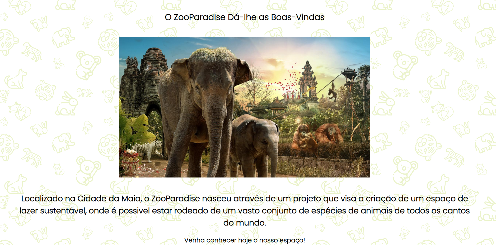
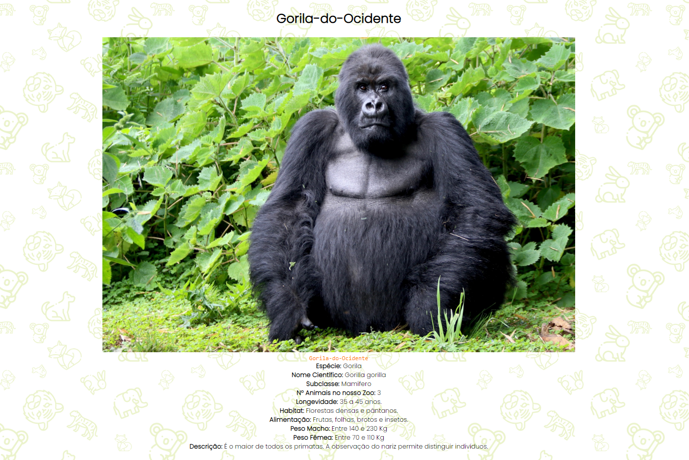
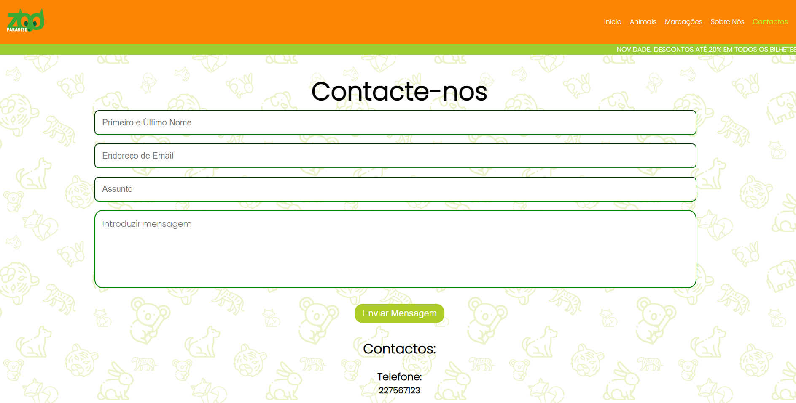

# 1 - Apresentação do projeto

Grupo de trabalho: 05

Elementos: 
- João Oliveira | A043242; 
- Miguel Silva | A043718; 
- Diogo Fernandes | A039679;

O trabalho proposto, dentro do tema "Animais", é uma página que permite dar a conhecer ao utilizador um zoo.

A página web é composta por um menu no topo, que tem os seguintes componentes: 
- Logótipo;
- Início;
- Animais;
- Marcações; 
- Sobre Nós;
- Contactos.

## Logótipo e Início
Tanto o Logótipo quanto o "Início" levam o utilizador para a página principal, onde estão apresentadas fotos e alguns
elementos relevantes ao utilizador.

## Animais
No componente "Animais", o utilizador tem acesso aos animais presentes no zoo.

Esta área tem também uma função educativa, que visa a dar a conhecer as características e descrição dos mesmos.

## Marcações
Na zona "Marcações", apresentamos o horário de funcionamento, os respetivos preços dos bilhetes (Dependendo das suas respetivas idades) 
e uma opção para a compra dos mesmos.

## Sobre Nós
Na área "Sobre Nós", o zoo dá a conhecer ao utilizador a localização do zoo, tanto como o número de telefone,
o e-mail e as redes sociais, sendo estas, facebook, twitter e instagram.

## Contactos
Dentro da página "Contactos", o zoo apresenta um formulário para o utilizador contactar o zoo. Este formulário é
composto pelos campos: Nome, Email, Assunto, Mensagem e por fim um botão para submeter.

Esta página apresenta, tal como a página **Sobre Nós**. o número de telefone, o e-mail e as redes sociais, sendo estas, facebook, twitter e instagram.

## Botão Adicional
Todas as páginas tem um botão com uma seta, que quando clicado, volta ao topo da página.

## Footer
O footer é composto pelos mesmos elementos que o menu do topo, sendo estes:
- Logótipo; 
- Início; 
- Animais; 
- Marcações; 
- Sobre Nós; 
- Contactos.

## Sucesso
Após a validação do formulário, o utilizado é levado para uma página onde é informado do sucesso do envio da mensagem.

# 2 - Interface com o utilizador

## Sitemap

## Interface da página **Início**

## Interface da pagina **Animais**

## Interface da página **Marcações**

## Interface da página **Sobre**

## Interface da página **Contactos**

## Interface da página **Sucesso**

# 3 - Produto

## Descrição
Este projeto permite ao utilizador visualizar os animais presentes neste zoo e conhecer as suas características,
permite também visualizar uma tabela de preços dos bilhetes e efetuar a sua compra online, é possivel ver também o horário de funcionamento,
para além disso o utilizador pode visualizar a localização do zoo a partir de um mapa, bem como todas as formas de contacto, e em caso 
de alguma duvida o utilizador pode enviar uma mensagem através da página contactos.

## Ligação para o site
https://tiwm22-ti-g05.netlify.app/paginas/

## Instruções de instalação e configuração -

## Regras de utilização
Não existem regras de utilização.

## Ajuda à navegação
Foi introduzido em todas as páginas um botão com uma seta, que quando clicado, volta ao topo da página.
Os menus de navegação estão organizados da seguinte forma: 
- Logótipo; 
- Início; 
- Animais; 
- Marcações; 
- Sobre Nós; 
- Contactos.

## Validação de formulários
O formulário está na página contactos. Para a validação do mesmo recorremos ao serviço da netlify - **Netlify Forms**.

O formulário envia uma mensagem com os campos introduzidos pelo utilizador.

## Validação HTML e CSS
Para a validação do HTML e CSS foi utilizado o "The W3C Markup Validation Service", o que permitiu verificar alguns erros e corrigir os mesmos.

## Detalhes de implementação

### Menu

### Tabela

### Formulário

### Hyperlink

### Imagens

### Marcação

### Listas

# 4 - Apresentação
